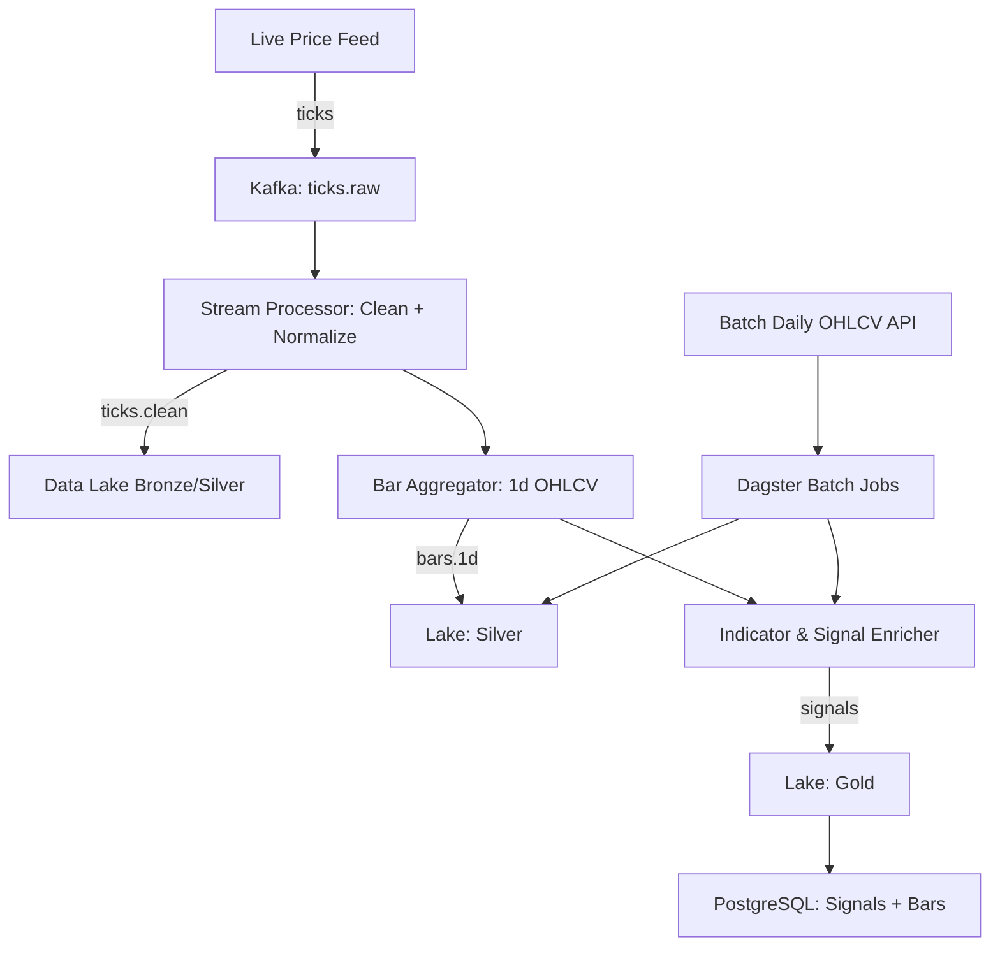

# Stock Market Data Pipeline

## Overview
This project implements an **end-to-end data pipeline** for stock market data.  
It ingests **live streaming prices** and **daily OHLCV data**, cleans and normalizes it,  
enriches with **technical indicators + simple buy/sell/hold signals**, and stores it for  
downstream consumers (e.g., backtesting engines, dashboards, live trading systems).

**Key Features**
- Live ingestion (ticks) via Kafka
- Batch ingestion (daily OHLCV)
- Real-time aggregation into 1d bars
- Technical indicators (EMA, RSI, MACD)
- Rule-based buy/sell/hold signal generation
- Query-ready serving layer in PostgreSQL
- Orchestration & data quality checks

---

## Architecture

---

